# Instructors and Mentors

The following list of scientists and software engineers are serving as instructors and mentors for the ARM Open Science Summer School!

| Instructor | Affiliation | Links | Headshot
| :------- | ------- |:------- | ------ |
| Robert Jackson | Argonne National Laboratory | -[Professional Website](https://www.anl.gov/profile/robert-jackson)   - [Github](https://github.com/rcjackson) | 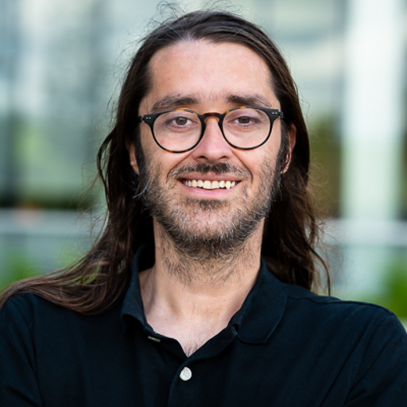
| Timothy Juliano | NSF National Center for Atmospheric Research | -[Professional Website](https://staff.ucar.edu/users/tjuliano)   -[Github](https://github.com/twjuliano) | 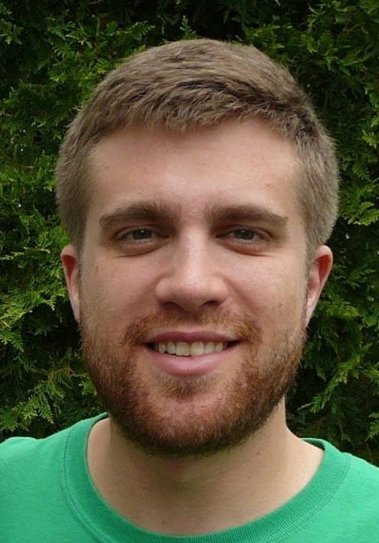
| Daniel Feldman | Lawerence Berkeley National Laboratory | -[Professional Website](https://profiles.lbl.gov/20998-daniel-feldman)   -[Github](https://github.com/twjuliano) | 
| Scott Collis | Argonne National Laboratory | -[Professional Website](https://www.anl.gov/profile/scott-m-collis)   -[Github](https://github.com/scollis) | 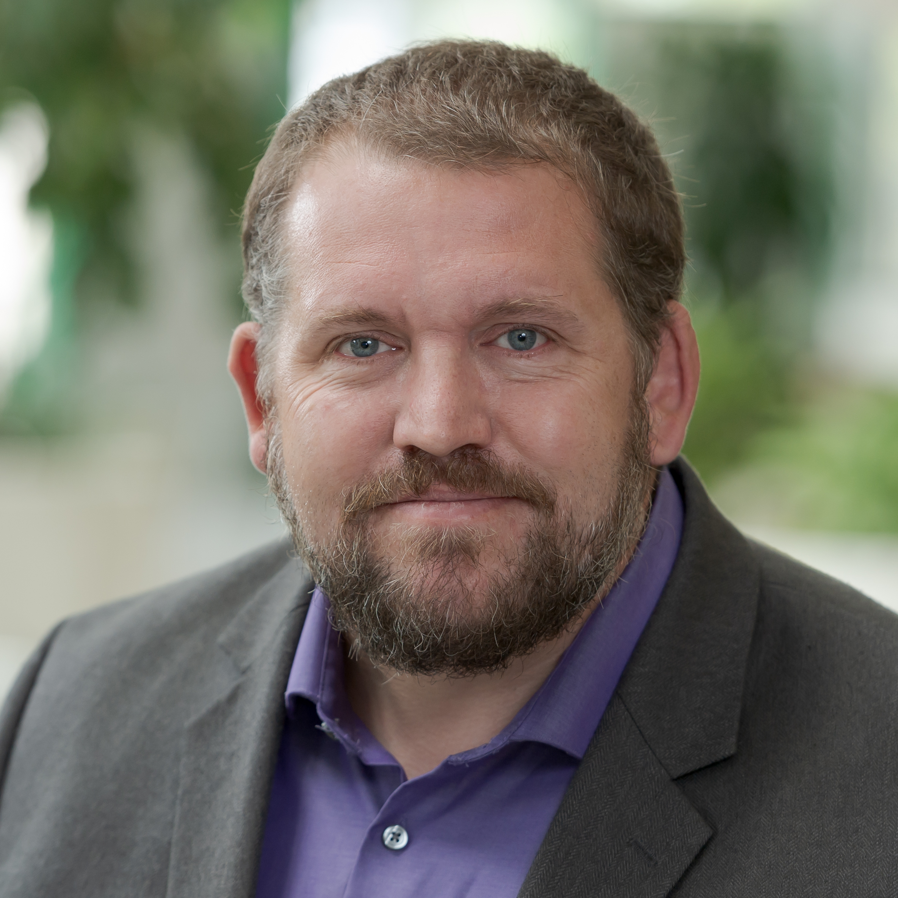
| Ann Fridlind | National Aeronautics and Space Administration   Goddard Institute for Space Studies | -[Professional Website](https://www.giss.nasa.gov/staff/afridlind.html)   -[Github](https://github.com/fridlind) | 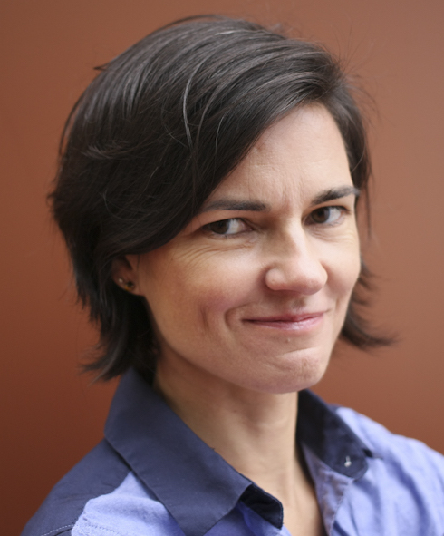
| Michael Giansiracusa | Oak Ridge National Laboratory | -[Professional Website](https://www.ornl.gov/staff-profile/michael-t-giansiracusa) | 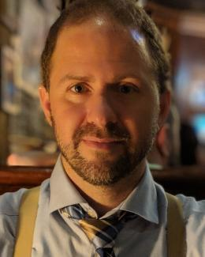
| Damao Zhang | Pacific Northwest National Laboratory | -[Professional Website](https://www.ornl.gov/staff-profile/michael-t-giansiracusa) | 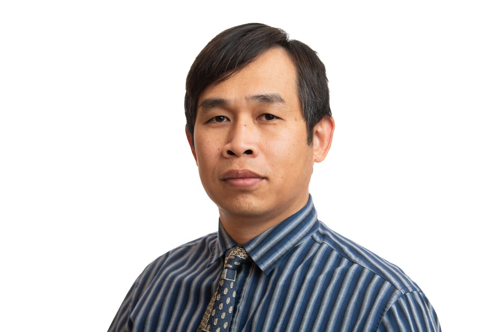
| Sujata Goswami | Oak Ridge National Laboratory | -[Professional Website](https://www.ornl.gov/staff-profile/sujata-goswami)   -[Github Link](https://github.com/SujataSaurabh)| 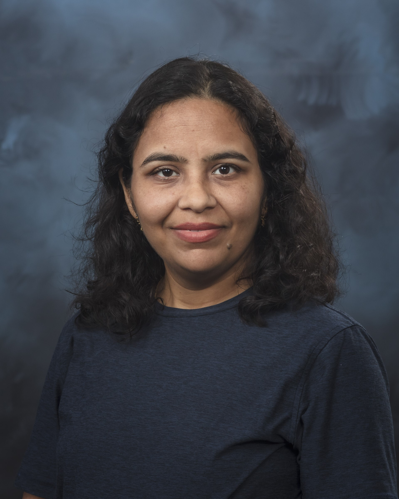
| William Gustafson | Pacific Northwest National Laboratory | -[Professional Website](https://www.pnnl.gov/people/william-i-gustafson-jr)   -[Github Link](https://github.com/wgustafson)| 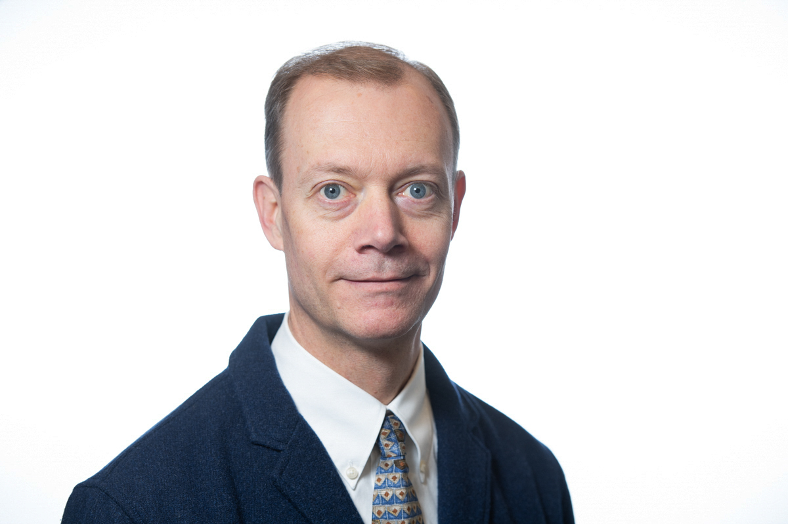
| Maxwell Grover | Argonne National Laboratory | -[Professional Website](https://www.anl.gov/profile/maxwell-grover)   -[Github Link](https://github.com/mgrover1)| 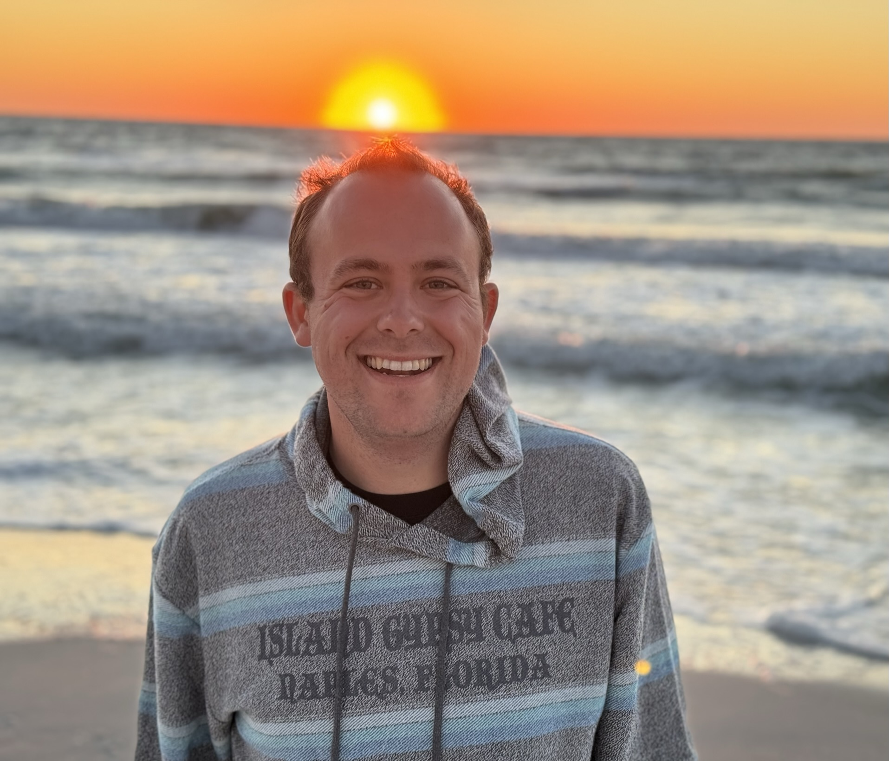
| Ya-Chien Feng | Pacific Northwest National Laboratory | -[Professional Website](https://www.pnnl.gov/science/staff/staff_info.asp?staff_num=10752)| 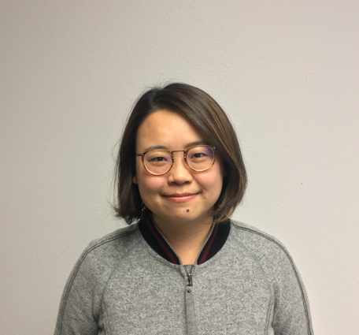
| Mia Li | Cooperative Institute for Severe and High-Impact Weather Research and Operations | -[Github](https://github.com/lishanlitamu)| 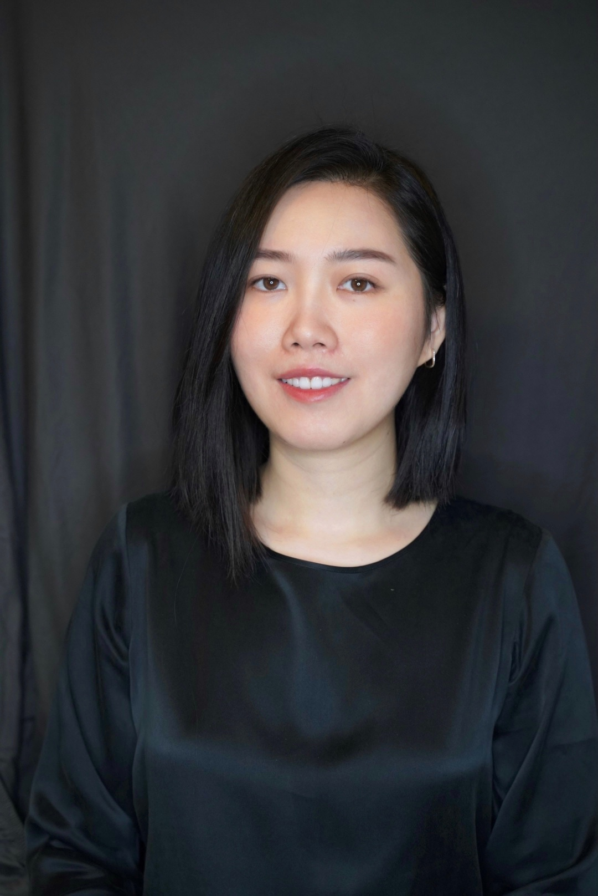
| Maxwell Grover | Argonne National Laboratory | -[Professional Website](https://www.anl.gov/profile/maxwell-grover)   -[Github Link](https://github.com/mgrover1)| 

